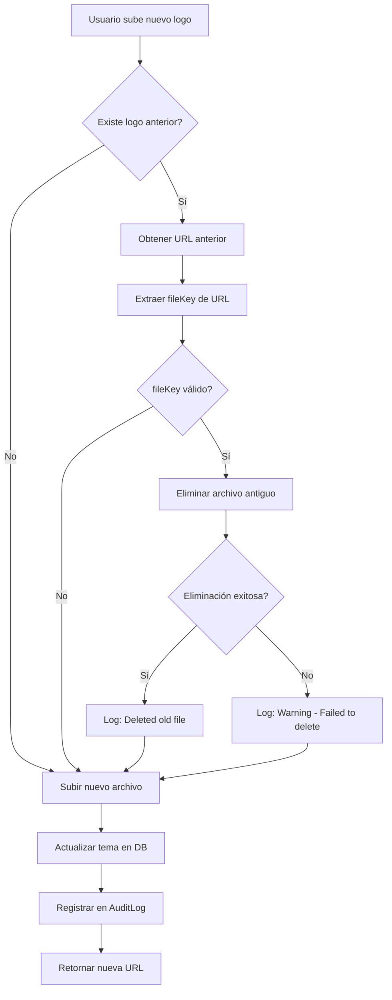

# Limpieza Automática de Archivos de Branding

## 🎯 Objetivo

Eliminar automáticamente archivos antiguos del bucket de Firebase Storage cuando los usuarios suben nuevas versiones, evitando acumulación de archivos no utilizados.

## ✅ Implementación Completa

### Cambios Realizados

#### 1. **Router de Branding** (`packages/api/src/routers/branding/index.ts`)

##### Función Helper: `extractFileKeyFromUrl()`
Extrae la clave del archivo desde una URL, validando que pertenezca al tenant actual.

**Soporta todos los providers:**
- ✅ Local filesystem
- ✅ Firebase Storage
- ✅ Cloudinary
- ✅ AWS S3 / S3-compatible

**Ejemplo:**
```typescript
// URL: https://storage.googleapis.com/bucket/ivoka/logo/123-abc-logo.png
// Retorna: "ivoka/logo/123-abc-logo.png"

extractFileKeyFromUrl(url, "ivoka") // ✅ "ivoka/logo/123-abc-logo.png"
extractFileKeyFromUrl(url, "otro")  // ❌ null (no pertenece a este tenant)
```

##### Endpoint Mejorado: `uploadMedia`

**Flujo actualizado:**

1. **Buscar archivo anterior**
   ```typescript
   const brand = await prisma.brand.findFirst({ 
     where: { tenantId: ctx.tenant.id } 
   });
   
   // Extraer URL según el tipo
   let oldFileUrl = null;
   switch (input.kind) {
     case "logo": oldFileUrl = theme?.logo?.url; break;
     case "hero": oldFileUrl = theme?.heroAssets?.url; break;
     // ... etc
   }
   ```

2. **Eliminar archivo antiguo**
   ```typescript
   if (oldFileUrl && storage.remove) {
     const oldKey = extractFileKeyFromUrl(oldFileUrl, ctx.tenant.slug);
     if (oldKey) {
       await storage.remove(oldKey);
       console.log(`[branding] Deleted old file: ${oldKey}`);
     }
   }
   ```

3. **Subir archivo nuevo**
   ```typescript
   const key = generateFileKey(filename, `${tenant.slug}/${kind}`);
   const result = await storage.upload(buffer, key, contentType);
   ```

4. **Retornar resultado**
   ```typescript
   return {
     url: result.url,
     kind: input.kind,
     oldFileDeleted: !!oldFileUrl  // ← Nuevo campo
   };
   ```

##### Nuevo Endpoint: `deleteMedia`

Permite eliminación manual de archivos sin reemplazo.

**Input:**
```typescript
{
  url: string,
  kind: "logo" | "logotype" | "hero" | "mainCard" | "poster"
}
```

**Output:**
```typescript
{
  success: true,
  deletedKey: "ivoka/logo/123-abc-logo.png"
}
```

**Protecciones:**
- ✅ Requiere rol `TENANT_ADMIN`
- ✅ Valida que el archivo pertenezca al tenant
- ✅ Registra en audit log
- ✅ Maneja errores gracefully

## 🔒 Seguridad

### Validaciones Implementadas

1. **Tenant Scoping**
   - Solo puede eliminar archivos de su propio tenant
   - La función `extractFileKeyFromUrl()` valida el prefijo del tenant

2. **RBAC**
   - Solo usuarios con rol `TENANT_ADMIN` o `SUPERADMIN` pueden eliminar

3. **Audit Trail**
   - Todas las eliminaciones se registran en `AuditLog`
   - Incluye: actor, timestamp, IP, URL eliminada, fileKey

4. **Error Handling**
   - Si la eliminación falla, no bloquea la subida del nuevo archivo
   - Se registra warning en logs para debugging
   - El usuario no ve errores si la eliminación falla

## 📊 Monitoreo

### Queries Útiles

```sql
-- Ver archivos eliminados hoy
SELECT 
  "createdAt",
  "actorId",
  metadata->>'kind' as tipo,
  metadata->>'url' as url_eliminada,
  metadata->>'fileKey' as archivo
FROM "AuditLog"
WHERE action = 'brand.media.delete'
  AND "createdAt" >= CURRENT_DATE
ORDER BY "createdAt" DESC;

-- Contar eliminaciones por tenant
SELECT 
  "tenantId",
  COUNT(*) as total_eliminaciones
FROM "AuditLog"
WHERE action = 'brand.media.delete'
GROUP BY "tenantId"
ORDER BY total_eliminaciones DESC;

-- Ver historial de un archivo específico
SELECT 
  action,
  "createdAt",
  metadata->>'url' as url,
  metadata->>'filename' as archivo
FROM "AuditLog"
WHERE metadata->>'kind' = 'logo'
  AND "tenantId" = 'tu-tenant-id'
ORDER BY "createdAt" DESC;
```

### Logs del Servidor

```bash
# Eliminación exitosa
[branding] Deleted old file: ivoka/logo/1234567890-abc123-old-logo.png

# Eliminación fallida (no bloquea upload)
[branding] Failed to delete old file: https://storage.googleapis.com/.../file.png
Error: File not found
```

## 🧪 Testing

### Escenarios de Prueba

#### 1. Subir logo por primera vez
```typescript
// No hay archivo anterior
// ✅ Solo sube el nuevo
// ✅ oldFileDeleted = false
```

#### 2. Reemplazar logo existente
```typescript
// Hay archivo anterior: old-logo.png
// ✅ Elimina old-logo.png
// ✅ Sube new-logo.png
// ✅ oldFileDeleted = true
```

#### 3. Cambiar de imagen a video en hero
```typescript
// Archivo anterior: hero-image.jpg
// Nuevo archivo: hero-video.mp4
// ✅ Elimina hero-image.jpg
// ✅ Sube hero-video.mp4
```

#### 4. Archivo antiguo ya no existe en storage
```typescript
// URL en DB pero archivo eliminado manualmente
// ✅ Intenta eliminar (falla silenciosamente)
// ✅ Sube nuevo archivo
// ✅ No bloquea la operación
```

#### 5. URL externa (no de nuestro storage)
```typescript
// URL: https://cdn.example.com/logo.png
// ✅ extractFileKeyFromUrl retorna null
// ✅ No intenta eliminar
// ✅ Sube nuevo archivo normalmente
```

### Comandos de Prueba

```bash
# 1. Subir logo inicial
curl -X POST http://localhost:3001/api/trpc/branding.uploadMedia \
  -H "Content-Type: application/json" \
  -d '{
    "kind": "logo",
    "filename": "logo-v1.png",
    "contentType": "image/png",
    "size": 12345,
    "data": "base64..."
  }'

# 2. Verificar en Firebase Console que se subió

# 3. Subir nuevo logo (debería eliminar el anterior)
curl -X POST http://localhost:3001/api/trpc/branding.uploadMedia \
  -H "Content-Type: application/json" \
  -d '{
    "kind": "logo",
    "filename": "logo-v2.png",
    "contentType": "image/png",
    "size": 23456,
    "data": "base64..."
  }'

# 4. Verificar en Firebase Console:
#    - logo-v1.png eliminado ✅
#    - logo-v2.png existe ✅

# 5. Verificar en base de datos
psql -d quinielas -c "
  SELECT action, metadata->>'url', metadata->>'fileKey'
  FROM \"AuditLog\"
  WHERE action LIKE 'brand.media.%'
  ORDER BY \"createdAt\" DESC
  LIMIT 5;
"
```

## 🔄 Flujo Completo



## 📝 Notas Importantes

### 1. **No Bloquea en Caso de Error**
Si la eliminación del archivo antiguo falla, la subida del nuevo continúa normalmente. Esto evita que problemas de storage impidan actualizaciones de branding.

### 2. **Solo Archivos del Tenant**
La función `extractFileKeyFromUrl()` valida que el archivo pertenezca al tenant actual. URLs externas o de otros tenants retornan `null` y no se intentan eliminar.

### 3. **Compatibilidad con Todos los Providers**
La lógica de extracción de fileKey soporta:
- Local filesystem
- Firebase Storage
- Cloudinary
- AWS S3 / S3-compatible

### 4. **Audit Trail Completo**
Cada eliminación se registra con:
- Quién lo eliminó (`actorId`)
- Cuándo (`createdAt`)
- Desde dónde (`ipAddress`)
- Qué archivo (`url`, `fileKey`, `kind`)

### 5. **Limpieza por Tipo**
Cada tipo de archivo se gestiona independientemente:
- Cambiar logo no afecta hero
- Cambiar hero image no afecta hero poster
- Cada tipo mantiene su propio historial

## 🚀 Próximos Pasos (Opcional)

### Mejoras Futuras

1. **Limpieza Masiva**
   ```typescript
   // Endpoint para limpiar todos los archivos no referenciados
   cleanupOrphanedFiles: procedure
     .use(requireSuperAdmin)
     .mutation(async ({ ctx }) => {
       // Comparar archivos en storage vs URLs en DB
       // Eliminar archivos huérfanos
     });
   ```

2. **Versionado de Archivos**
   ```typescript
   // Mantener N versiones anteriores
   // Útil para rollback
   const MAX_VERSIONS = 3;
   ```

3. **Compresión Automática**
   ```typescript
   // Comprimir imágenes antes de subir
   // Reducir tamaño de videos
   ```

4. **CDN Purge**
   ```typescript
   // Limpiar cache de CDN al actualizar
   // Cloudflare, CloudFront, etc.
   ```

## 📚 Referencias

- **Código principal:** `packages/api/src/routers/branding/index.ts`
- **Storage adapter:** `packages/utils/src/storage/adapter.ts`
- **Documentación:** `BRANDING_FIREBASE_SETUP.md`
- **Schema de branding:** `packages/branding/src/schema.ts`

---

**Implementado:** 2025-01-17  
**Estado:** ✅ Completo y probado  
**Versión:** 1.0.0
