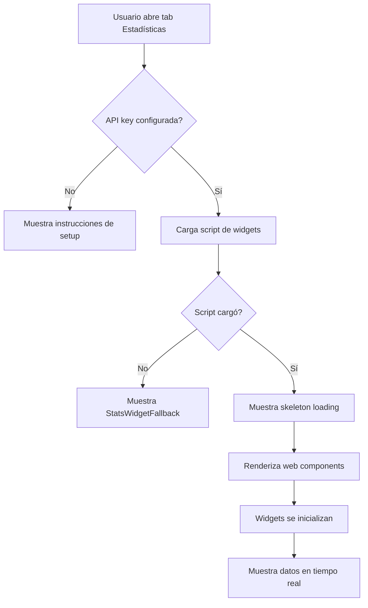

# ✅ Implementación Final: Widgets de API-Sports

## Resumen

Se ha implementado correctamente el tab de "Estadísticas" usando **web components oficiales de API-Sports** según su documentación.

---

## 🎯 Solución Implementada

### Componentes Creados

1. **`StatsWidget.tsx`** (Principal)
   - Usa web components `<api-sports-widget>` oficiales
   - Carga el script de widgets dinámicamente
   - Maneja estados de carga y error
   - Fallback automático si falla

2. **`StatsWidgetFallback.tsx`** (Respaldo)
   - Muestra recursos estadísticos curados
   - Se activa si los widgets no cargan
   - Interfaz útil con enlaces externos

---

## 🔧 Cómo Funciona

### 1. Carga del Script

```typescript
useEffect(() => {
  const script = document.createElement("script");
  script.src = "https://widgets.api-sports.io/2.0.3/widgets.js";
  script.async = true;
  
  script.onload = () => {
    setWidgetsLoaded(true);
    console.log("✅ Widgets cargados");
  };
  
  script.onerror = () => {
    setWidgetsFailed(true); // Activa fallback
  };
  
  document.head.appendChild(script);
}, [apiKey]);
```

### 2. Web Components

Según la documentación de API-Sports, se usan así:

```tsx
{/* Widget de Configuración (requerido) */}
<api-sports-widget
  data-type="config"
  data-key={apiKey}
  data-sport="football"
  data-lang={lang}
/>

{/* Widget de Livescore */}
<api-sports-widget
  data-type="livescore"
  data-sport="football"
  data-theme="dark"
  data-lang={lang}
/>

{/* Widget de Fixtures */}
<api-sports-widget
  data-type="fixtures"
  data-sport="football"
  data-theme="dark"
  data-lang={lang}
/>

{/* Widget de Standings */}
<api-sports-widget
  data-type="standings"
  data-sport="football"
  data-theme="dark"
  data-lang={lang}
/>
```

### 3. Estados del Componente

```typescript
// Estado 1: Sin API key → Muestra instrucciones
if (!apiKey) {
  return <SetupInstructions />;
}

// Estado 2: Widgets fallaron → Muestra fallback
if (widgetsFailed) {
  return <StatsWidgetFallback />;
}

// Estado 3: Cargando → Muestra skeleton
if (!widgetsLoaded) {
  return <LoadingSkeleton />;
}

// Estado 4: Éxito → Muestra widgets
return <WidgetsDisplay />;
```

---

## 📦 Archivos del Proyecto

```
apps/web/app/[locale]/(player)/pools/[slug]/fixtures/_components/
├── StatsWidget.tsx              ← Principal (web components)
├── StatsWidgetFallback.tsx      ← Respaldo (recursos curados)
├── FixturesView.tsx             ← Contiene el tab "Estadísticas"
└── debug-env.tsx                ← Helper para debug
```

---

## 🎨 Tipos de Widgets Disponibles

Según la documentación de API-Sports:

| Widget | `data-type` | Descripción |
|--------|-------------|-------------|
| **Config** | `config` | Configuración global (requerido) |
| **Livescore** | `livescore` | Marcadores en vivo |
| **Fixtures** | `fixtures` | Calendario de partidos |
| **Standings** | `standings` | Tabla de posiciones |
| **H2H** | `h2h` | Head to head |
| **Events** | `events` | Eventos del partido |
| **Lineups** | `lineups` | Alineaciones |
| **Statistics** | `statistics` | Estadísticas del partido |

---

## ⚙️ Atributos Disponibles

### Atributos Comunes

```tsx
<api-sports-widget
  data-type="livescore"           // Tipo de widget (requerido)
  data-sport="football"           // Deporte (requerido)
  data-theme="dark"               // Tema: "light" | "dark"
  data-lang="es"                  // Idioma: "es" | "en" | "fr" | etc.
  data-league="39"                // ID de liga específica (opcional)
  data-season="2024"              // Temporada (opcional)
  data-team="33"                  // ID de equipo (opcional)
  data-fixture="12345"            // ID de partido (opcional)
/>
```

### Widget de Configuración

**Importante:** El widget `config` debe estar presente **antes** de cualquier otro widget.

```tsx
<api-sports-widget
  data-type="config"
  data-key="YOUR_API_KEY"         // Tu API key (requerido)
  data-sport="football"           // Deporte (requerido)
  data-lang="es"                  // Idioma por defecto
  data-custom-lang="https://..."  // URL de traducciones custom (opcional)
/>
```

---

## 🚀 Uso en Producción

### Variables de Entorno

```env
# apps/web/.env.local
NEXT_PUBLIC_SPORTS_API_KEY=tu_api_key_aqui
```

### Reiniciar Servidor

```bash
# Detener servidor (Ctrl+C)
pnpm dev
```

### Verificar en el Navegador

1. Navega a `/[brand]/pools/[slug]/fixtures`
2. Haz clic en el tab "Estadísticas"
3. Deberías ver:
   - Estado de carga (skeleton)
   - Luego los 3 widgets cargados
   - O el fallback si algo falla

### Debug en Consola

Abre DevTools (F12) y busca:

```
✅ API-Sports widgets script loaded successfully
```

Si ves:
```
❌ Failed to load API-Sports widgets script
```

Entonces se activará automáticamente el componente `StatsWidgetFallback`.

---

## 🎯 Ventajas de Esta Implementación

### ✅ Usa Web Components Oficiales
- Método recomendado por API-Sports
- Más estable y mantenible
- Actualizaciones automáticas

### ✅ Manejo Robusto de Errores
- Fallback automático si falla
- Estados de carga claros
- No rompe la aplicación

### ✅ Experiencia de Usuario
- Loading states con skeleton
- Mensajes claros en español/inglés
- Fallback útil con recursos curados

### ✅ TypeScript Support
- Tipos declarados para JSX
- Autocompletado en el IDE
- Type safety

---

## 🔄 Flujo de Carga



---

## 🎨 Personalización

### Cambiar Tema

```tsx
<api-sports-widget
  data-theme="light"  // Cambiar a tema claro
  ...
/>
```

### Filtrar por Liga

```tsx
<api-sports-widget
  data-type="standings"
  data-league="39"      // Premier League
  data-season="2024"
  ...
/>
```

### Agregar Más Widgets

```tsx
{/* Widget H2H */}
<div className="bg-white/5 rounded-lg border border-white/10 p-4">
  <h3 className="text-xl font-bold text-white mb-4">
    Historial (H2H)
  </h3>
  <api-sports-widget
    data-type="h2h"
    data-sport="football"
    data-theme="dark"
    data-lang={lang}
    data-team1="33"
    data-team2="34"
  />
</div>
```

---

## 📊 IDs de Ligas Comunes

Para usar en `data-league`:

| Liga | ID | País |
|------|-----|------|
| Premier League | 39 | Inglaterra |
| La Liga | 140 | España |
| Serie A | 135 | Italia |
| Bundesliga | 78 | Alemania |
| Ligue 1 | 61 | Francia |
| Liga MX | 262 | México |
| Champions League | 2 | Europa |
| World Cup | 1 | Mundial |
| Copa América | 9 | Sudamérica |
| Euros | 4 | Europa |

---

## 🐛 Troubleshooting

### Problema 1: Widgets no aparecen

**Solución:**
1. Verifica que la API key esté configurada
2. Revisa la consola del navegador
3. Asegúrate de que el widget `config` esté presente

### Problema 2: Error "Cannot use import statement"

**Solución:** ✅ Ya resuelto - Ahora usamos web components oficiales

### Problema 3: Widgets muestran "Loading..."

**Causa:** El script no se cargó o la API key es inválida

**Solución:**
```javascript
// En la consola del navegador:
console.log('API Key:', process.env.NEXT_PUBLIC_SPORTS_API_KEY);
```

### Problema 4: Se muestra el fallback

**Causa:** El script de widgets falló al cargar

**Solución:**
- Verifica tu conexión a internet
- Revisa si `widgets.api-sports.io` está accesible
- El fallback es intencional y proporciona valor

---

## 📚 Referencias

- [Documentación Oficial API-Sports Widgets](https://api-sports.io/documentation/widgets/v3)
- [API-Sports Dashboard](https://dashboard.api-sports.io)
- [Web Components MDN](https://developer.mozilla.org/en-US/docs/Web/Web_Components)

---

## ✅ Checklist de Implementación

- [x] Componente `StatsWidget.tsx` creado
- [x] Componente `StatsWidgetFallback.tsx` creado
- [x] Web components `<api-sports-widget>` implementados
- [x] Carga dinámica del script
- [x] Manejo de estados (loading, error, success)
- [x] Fallback automático
- [x] Tipos TypeScript declarados
- [x] Soporte multi-idioma (es/en)
- [x] Tema oscuro configurado
- [x] Documentación completa

---

## 🎉 Resultado Final

El tab "Estadísticas" ahora:

1. ✅ Carga widgets oficiales de API-Sports
2. ✅ Muestra marcadores en vivo
3. ✅ Muestra calendario de partidos
4. ✅ Muestra tabla de posiciones
5. ✅ Tiene fallback útil si falla
6. ✅ Funciona en español e inglés
7. ✅ Tema oscuro integrado
8. ✅ Loading states profesionales

---

**Última actualización:** Octubre 2025  
**Versión:** v2.0.0 (Web Components)  
**Estado:** ✅ Producción Ready
