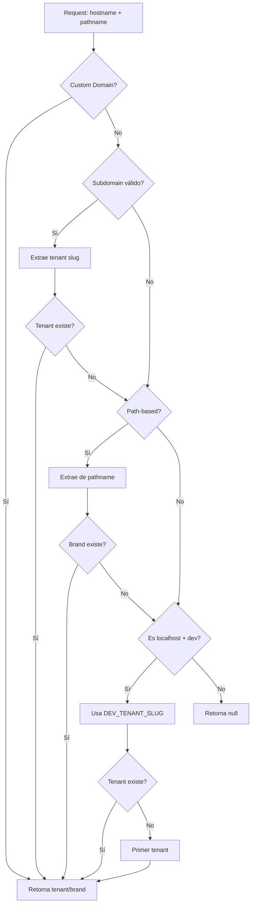

# Estrategia de Resolución de Tenant

## 🎯 Objetivo

Resolver el tenant y brand correctos basándose en el hostname y pathname de la petición HTTP, siguiendo una estrategia de prioridades clara.

## 📋 Estrategias de Resolución (en orden de prioridad)

### 1. **Custom Domain** (Dominio Personalizado)
**Prioridad:** ALTA  
**Ejemplo:** `quinielas.cemex.com`

```typescript
// Busca en Brand.domains[]
const brandByDomain = await prisma.brand.findFirst({
  where: {
    domains: { has: hostname }
  },
  include: { tenant: true }
});
```

**Casos de uso:**
- Cliente enterprise con dominio propio
- Marca con múltiples dominios personalizados

**Ejemplo:**
```
Hostname: quinielas.cemex.com
→ Busca Brand con domains = ["quinielas.cemex.com"]
→ Retorna: { tenant: CEMEX, brand: CEMEX_BRAND, source: "domain" }
```

---

### 2. **Subdomain Pattern** (Patrón de Subdominio)
**Prioridad:** MEDIA  
**Ejemplo:** `ivoka.quinielas.mx`

```typescript
// Extrae tenant slug del primer segmento
const tenantSlug = hostname.split(".")[0]; // "ivoka"

const tenant = await prisma.tenant.findUnique({
  where: { slug: tenantSlug }
});
```

**Validaciones:**
- Hostname debe tener al menos 3 partes: `[tenant].[base].[tld]`
- Excluye subdomains comunes: `www`, `api`, `admin`, `cdn`, `static`
- Ignora `localhost` e IPs

**Ejemplo:**
```
Hostname: ivoka.quinielas.mx
→ Extrae: "ivoka"
→ Busca Tenant con slug = "ivoka"
→ Busca Brand con tenantId + slug = "default"
→ Retorna: { tenant: IVOKA, brand: IVOKA_DEFAULT, source: "subdomain" }
```

---

### 3. **Path-based Resolution** (Resolución por Ruta)
**Prioridad:** BAJA  
**Ejemplo:** `/es-MX/ivoka/default/pools`

```typescript
// Extrae tenant y brand de los segmentos del path
const pathSegments = pathname.split("/").filter(Boolean);
// Salta locale si existe (es-MX, en-US, etc.)
const [tenantSlug, brandSlug] = pathSegments.slice(startIdx);

const brand = await prisma.brand.findFirst({
  where: {
    slug: brandSlug,
    tenant: { slug: tenantSlug }
  },
  include: { tenant: true }
});
```

**Casos de uso:**
- Multi-tenant en un solo dominio
- Ambientes de desarrollo compartidos

**Ejemplo:**
```
Pathname: /es-MX/ivoka/default/pools
→ Extrae: tenantSlug = "ivoka", brandSlug = "default"
→ Busca Brand con slug = "default" y tenant.slug = "ivoka"
→ Retorna: { tenant: IVOKA, brand: IVOKA_DEFAULT, source: "path" }
```

---

### 4. **Development Fallback** (Fallback de Desarrollo)
**Prioridad:** FALLBACK  
**Solo aplica:** `NODE_ENV === "development"` Y `hostname === "localhost"`

```typescript
// Opción A: Variable de entorno
const fallbackSlug = process.env.DEV_TENANT_SLUG; // "ivoka"
const tenant = await prisma.tenant.findUnique({
  where: { slug: fallbackSlug }
});

// Opción B: Primer tenant disponible (si no hay DEV_TENANT_SLUG)
const tenant = await prisma.tenant.findFirst({
  orderBy: { createdAt: "asc" }
});
```

**⚠️ IMPORTANTE:** Este fallback **SOLO** se usa en `localhost`. En producción, **siempre** se debe usar subdomain o custom domain.

**Ejemplo:**
```
Hostname: localhost:3001
NODE_ENV: development
DEV_TENANT_SLUG: ivoka
→ Busca Tenant con slug = "ivoka"
→ Retorna: { tenant: IVOKA, brand: IVOKA_DEFAULT, source: "fallback" }
```

---

## 🚀 Flujo Completo



## 📝 Configuración

### Producción

**Subdomain (recomendado):**
```
URL: https://ivoka.quinielas.mx
→ Automático, no requiere configuración
```

**Custom Domain:**
```sql
-- Agregar dominio personalizado al Brand
UPDATE "Brand"
SET domains = ARRAY['quinielas.cemex.com']
WHERE slug = 'cemex-brand';
```

### Desarrollo (localhost)

**Opción 1: Variable de entorno (recomendado)**
```env
# .env.local
DEV_TENANT_SLUG=ivoka
```

**Opción 2: Usar subdomain en localhost**
```
# Editar /etc/hosts (Linux/Mac) o C:\Windows\System32\drivers\etc\hosts (Windows)
127.0.0.1 ivoka.localhost

# Acceder a:
http://ivoka.localhost:3001
```

**Opción 3: Automático (primer tenant)**
```
# No configurar DEV_TENANT_SLUG
# El sistema usa el primer tenant de la DB
```

## 🧪 Testing

### Test 1: Custom Domain
```typescript
const result = await resolveTenantAndBrandFromHost("quinielas.cemex.com");
expect(result.source).toBe("domain");
expect(result.tenant.slug).toBe("cemex");
```

### Test 2: Subdomain
```typescript
const result = await resolveTenantAndBrandFromHost("ivoka.quinielas.mx");
expect(result.source).toBe("subdomain");
expect(result.tenant.slug).toBe("ivoka");
```

### Test 3: Path-based
```typescript
const result = await resolveTenantAndBrandFromHost(
  "app.quinielas.mx",
  "/es-MX/ivoka/default/pools"
);
expect(result.source).toBe("path");
expect(result.tenant.slug).toBe("ivoka");
expect(result.brand.slug).toBe("default");
```

### Test 4: Development Fallback
```typescript
process.env.NODE_ENV = "development";
process.env.DEV_TENANT_SLUG = "ivoka";

const result = await resolveTenantAndBrandFromHost("localhost");
expect(result.source).toBe("fallback");
expect(result.tenant.slug).toBe("ivoka");
```

## 🔒 Seguridad

### Validaciones Implementadas

1. **Subdomain Sanitization:**
   - Excluye `www`, `api`, `admin`, `cdn`, `static`
   - Ignora IPs y `localhost` (excepto en dev)

2. **Path Injection Prevention:**
   - Valida formato de locale (`/^[a-z]{2}-[A-Z]{2}$/`)
   - Filtra segmentos vacíos

3. **Tenant Isolation:**
   - Cada request solo puede acceder a un tenant
   - No hay cross-tenant access sin SUPERADMIN

## 🐛 Troubleshooting

### Problema: "Tenant context required" en localhost

**Causa:** No se está resolviendo el tenant correctamente.

**Solución:**
```env
# Agrega a .env.local
DEV_TENANT_SLUG=tu-tenant-slug
```

### Problema: Subdomain no funciona en producción

**Causa:** DNS no está configurado correctamente.

**Solución:**
```
# Configurar DNS wildcard
*.quinielas.mx → A record → tu-servidor-ip
```

### Problema: Custom domain no funciona

**Causa:** El dominio no está en `Brand.domains[]`.

**Solución:**
```sql
UPDATE "Brand"
SET domains = domains || ARRAY['nuevo-dominio.com']
WHERE id = 'brand-id';
```

## 📊 Logs de Debugging

Los logs muestran la estrategia usada:

```
[host-tenant] Hostname: ivoka.quinielas.mx
[host-tenant] Strategy: subdomain
[host-tenant] Found tenant: ivoka
[host-tenant] Found brand: default
```

```
[host-tenant] Hostname: localhost
[host-tenant] Localhost detected, using development fallback
[host-tenant] Using DEV_TENANT_SLUG: ivoka
[host-tenant] Found tenant: ivoka
```

## 🎯 Resumen

| Ambiente | Hostname | Estrategia | Configuración |
|----------|----------|------------|---------------|
| **Producción** | `ivoka.quinielas.mx` | Subdomain | Automático |
| **Producción** | `quinielas.cemex.com` | Custom Domain | `Brand.domains[]` |
| **Desarrollo** | `localhost:3001` | Fallback | `DEV_TENANT_SLUG` |
| **Desarrollo** | `ivoka.localhost:3001` | Subdomain | `/etc/hosts` |

---

**Última actualización:** 2025-01-17  
**Archivo:** `packages/api/src/lib/host-tenant.ts`
